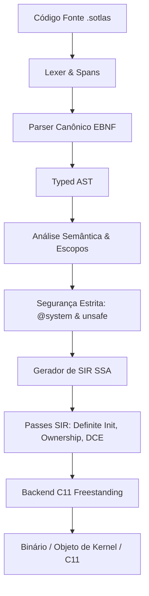

<div align="center">


# ⚡ Linguagem de Programação Sotlas

**Segura por padrão, assumidamente capaz de sistemas.**  
*Criada para sanar as lacunas históricas de segurança, modularidade e controle deixadas pelo C, C++ e Objective-C.*

[](https://github.com/Sotlas/sotlas/actions)
[](LICENSE)
[](#)
[](#)
[](#)

[Visão Geral](#-visão-geral) • [Por que Sotlas?](#-por-que-sotlas-superando-c-c-e-objective-c) • [Tour Guiado](docs/guided_tour.md) • [Arquitetura](#-arquitetura-do-compilador) • [Biblioteca Padrão](#-biblioteca-padrão-stdlib) • [Quickstart](#-quickstart) • [Exemplos](examples/)

</div>

---

## 🌟 Visão Geral

**Sotlas** é uma linguagem de programação de sistemas moderna concebida para o desenvolvimento de **sistemas operacionais (BakenOS)**, **firmware bare-metal**, **drivers de hardware**, **motores gráficos** e **serviços de alto desempenho**.

Sotlas é um projeto experimental de linguagem de sistemas que evolui em direção a abstrações de custo zero (*zero-cost abstractions*), fronteiras explícitas de segurança, ownership verificável e compilação modular limpa sem exigir um garbage collector de rastreamento. O caminho de produção atual ainda é um compilador Stage 0, e nem todo recurso de pesquisa descrito pelo projeto está implementado de ponta a ponta.

---

## 🧭 Maturidade de Implementação

Sotlas usa rótulos explícitos de maturidade para que a documentação não fique à frente da implementação:

| Status | Significado |
| :--- | :--- |
| **SUPPORTED** | Especificação, parser, verificação semântica, lowering/backend, testes positivos, negativos e end-to-end estão presentes |
| **EXPERIMENTAL** | Existe implementação, mas o contrato completo de suporte ainda não foi comprovado |
| **PROTOTYPE** | Implementação de pesquisa/tooling fora do contrato de compilação de produção |
| **DESIGNED** | Especificado, porém ainda não implementado de ponta a ponta |
| **PLANNED** | Item de roadmap |

A rota de produção atual é o frontend Stage 0 canônico em `compiler/sotlas_compile`, seguido pelas verificações semânticas e lowering C11. SIR é uma arquitetura-alvo em desenvolvimento ativo, ainda não a rota de lowering de produção.

---

## 🎯 Por que Sotlas? Superando C, C++ e Objective-C

Durante décadas, a engenharia de sistemas e desenvolvimento de sistemas operacionais esteve presa a linguagens legadas que acumularam lacunas críticas:

### 1. As Lacunas do C
* **Falta de Segurança de Memória**: Acesso irrestrito a ponteiros crus gera vulnerabilidades crônicas (*buffer overflows*, *use-after-free*, *dangling pointers*).
* **Ausência de Módulos**: Dependência frágil do pré-processador (`#include`), sujeita a colisões globais de nomes e poluição de macros.
* **Erros Frágeis**: Retorno manual de inteiros mágicos (`-1`, `NULL`), frequentemente ignorados pelos programadores.
* **Sem Distinção de Privilégios**: Acesso a hardware (portas I/O, registradores de CPU) é indistinguível de simples manipulação de memória local.

### 2. As Lacunas do C++
* **Complexidade e Sobrecarga Excessiva**: Especificações gigantescas, templates que explodem tempos de compilação e código binário.
* **Incompatibilidade com Bare-Metal**: Exceções, RTTI e destruidores não-determinísticos impõem um runtime oculto inadequado para o desenvolvimento de kernels de sistemas operacionais.
* **Pesadelo de ABI**: Falta de uma ABI estável entre compiladores e versões diferentes.

### 3. As Lacunas do Objective-C
* **Sobrecarga de Despacho Dinâmico**: Mensagens dinâmicas via runtime (`objc_msgSend`) impõem custo proibitivo para laços críticos de renderização e escalonamento de kernel.
* **Comportamento Ocultador de Bugs**: Enviar mensagens para ponteiros nulos (*nil-messaging*) mascara falhas graves que deveriam ser detectadas em tempo de compilação.
* **Falta de Abstrações Zero-Cost**: Estruturas de baixo nível puras e semântica de valor são cidadãos de segunda classe frente a objetos dinâmicos.

---

## 🔬 Matriz de Comparação Técnica

| Recurso / Desafio | **Sotlas** | **C11** | **C++20** | **Objective-C** |
| :--- | :---: | :---: | :---: | :---: |
| **Segurança por Padrão** | 🧪 Em evolução / parcial | ❌ Não | ❌ Não | ❌ Não |
| **Separação Privilégio vs Memória** | **`@system` vs `unsafe`** | ❌ Misturado | ❌ Misturado | ❌ Misturado |
| **Semântica de Valor (Zero-Cost)** | ✅ `struct` de valor | ✅ `struct` básica | ⚠️ Requer cópias manuais | ❌ Quase tudo objeto |
| **Contagem de Referência (ARC)** | 🧪 Primitivas disponíveis; garantia completa ainda não comprovada | ❌ Manual | ⚠️ `std::shared_ptr` pesado | ⚠️ ARC acoplado a runtime dinâmico |
| **Sistema Canônico de Módulos** | ✅ `module` & `import` | ❌ `#include` de texto | ⚠️ Módulos complexos | ❌ `#include` / `#import` |
| **Contratos e Protocolos** | 🧪 `spec` / `adopts` experimental | ❌ Inexistente | ⚠️ Múltipla herança / Concepts | ⚠️ Protocols dinâmicos |
| **Tratamento de Erros Tipado** | ✅ `Option<T>` / `Result<T, E>` | ❌ Inteiros mágicos | ⚠️ Exceções (proibidas em kernel) | ⚠️ NSError / nil checks |
| **Target Bare-Metal / Freestanding** | ✅ Cidadão de 1ª classe | ✅ Nativo | ⚠️ Difícil sem runtime | ❌ Incompatível sem runtime GNUstep/Apple |
| **Intermediário SSA para Análise** | 🧪 **Protótipo SIR**; ainda não é o lowering de produção | ❌ Nenhum | ❌ Nenhum | ❌ Nenhum |
| **ABI C Estável e Bidirecional** | 🚧 Objetivo de design; contrato completo de estabilidade ainda não congelado | ✅ Nativa | ⚠️ Instável (`extern "C"` parcial) | ⚠️ Frágil fora da Apple |

---

## 🌐 Arquitetura de Interoperabilidade em 3 Camadas (C, C++, Objective-C)

> **Objetivo Formal de Interoperabilidade:**
> *"Sotlas deve possuir uma ABI C estável e bidirecional, permitindo interoperabilidade incremental com C, assembly, Objective-C e outras linguagens capazes de consumir C ABI, mantendo toda memória externa e ponteiros FFI atrás de fronteiras explícitas unsafe."*

Sotlas foi desenhado para superar as deficiências de linguagens legadas sem virar uma ilha isolada. A linguagem adota uma separação rigorosa em **3 camadas ortogonais**:

```text
                ┌──────────────────────────────────────┐
                │          Sotlas Safe Layer           │
                │ Objects / Arrays / Optionals / UI    │
                │ Totalmente segura e sem ponteiros crus│
                └──────────────────┬───────────────────┘
                                   │
                           explicit @system
                                   │
                ┌──────────────────▼───────────────────┐
                │        Sotlas Systems Layer          │
                │ Pointers / MMIO / DMA / Interrupts   │
                │ Isolamento de hardware do BakenOS    │
                └──────────────────┬───────────────────┘
                                   │
                              extern "C"
                                   │
            ┌──────────────────────▼──────────────────────┐
            │       C / C++ (extern "C") / Objective-C    │
            │          Assembly & Firmware                │
            │ Memória externa não confiável (unsafe)      │
            └─────────────────────────────────────────────┘
```

### O Pipeline da Fronteira Perigosa:
```text
Objective-C / C / C++ ──► [Unsafe Boundary] ──► Sotlas Systems ──► [Safe Abstractions] ──► Sotlas Safe Layer
```

- **Guardrails no Estilo Rust**: `0xDEADBEEF as *mut u32` e desreferenciamento `*ptr` são rejeitados pelo compilador fora de blocos `unsafe { ... }`.
- **Fronteira FFI Explícita**: Funções em `extern "C"` que manipulam ponteiros crus carregam risco explícito e são consumidas exclusivamente sob blocos `unsafe` na camada `@system`.
- **Zero Overhead no Kernel**: Sem runtime de *nil-messaging* ou lookups dinâmicos de seletores do Objective-C dentro do kernel; a interoperação é feita via bridges C ABI diretas e sem custo oculto.

---

## 🏗️ Arquitetura do Compilador

Sotlas evolui em direção a uma arquitetura em camadas estritas centrada em uma representação intermediária SSA (**SIR — Sotlas Intermediate Representation**). Hoje, a rota Stage 0 de produção ainda faz lowering pelo frontend canônico diretamente para C11, enquanto SIR permanece uma rota de protótipo/tooling:



### Principais Componentes:
- **`compiler/sotlas/frontend/`**: Analisador léxico e sintático canônico com geração de spans precisos de erro.
- **`compiler/sotlas/sema/`**: Verificação de tipos, checagem de escopos, resolução de nomes e inferência de tipos.
- **`compiler/sotlas/safety/`**: Sistema ortogonal de segurança: isola capacidades de hardware (`@system`) de blocos de manipulação de memória crua (`unsafe { ... }`).
- **`compiler/sotlas/sir/`**: **Sotlas Intermediate Representation**, representação SSA para verificações de inicialização definitiva (*definite initialization*), auditoria de privilégios e otimizações de ARC.
- **`compiler/sotlas/codegen/`**: Backend C11 estrito (Bootstrap Stage 0) que emite código ANSI/ISO C11 portável para compiladores nativos e cross-compilers (GCC, Clang) sem dependências externas.

---

## 📦 Biblioteca Padrão (`stdlib/`)

A biblioteca padrão de Sotlas é implementada inteiramente na própria linguagem (**Sotlas in Sotlas**) com contratos freestanding adequados para kernels e firmware:

- **`stdlib/core/primitives.sotlas`**: Constantes e operações puras de tipos inteiros e ponto flutuante.
- **`stdlib/core/option.sotlas`**: Tipos canônicos `OptionU32`, `OptionI32` e `OptionPtr` eliminando bugs de desreferenciamento nulo.
- **`stdlib/core/result.sotlas`**: Tipos algébricos de erro `ResultU32`, `ResultI32` com enumeração de status `ResultCode`.
- **`stdlib/core/mem.sotlas`**: Rotinas de baixo nível freestanding (`zero_memory`, `copy_memory`, `compare_memory`, `Buffer`).
- **`stdlib/core/arc.sotlas`**: Primitivas de Automatic Reference Counting (`ArcHeader`, `SharedCounter`).
- **`stdlib/core/slice.sotlas`**: Fatias seguras com bounds checking (`ByteSlice`, `MutByteSlice`).
- **`stdlib/core/string.sotlas`**: Fatias de string UTF-8 (`StringSlice`, `string_equals`).
- **`stdlib/core/panic.sotlas`**: Manipulador de parada determinística para sistemas operacionais.
- **`stdlib/system/intrinsics.sotlas`**: Encapsulamento tipado de instruções de CPU de hardware com efeito `@system` (`inb`, `outb`, `cli`, `sti`, `hlt`).
- **`stdlib/runtime/`**: Runtime C11 freestanding (`runtime.h`, `runtime.c`) com zero dependências de libc.

---

## 🚀 Quickstart

### 1. Instalação
Clone o repositório e configure em modo editável:

```bash
git clone https://github.com/Sotlas/sotlas.git
cd sotlas
pip install -e .
```

### 2. Comandos do Driver CLI (`sotlas`)

O driver unificado oferece controle completo sobre o ciclo de vida do código:

```bash
# Exibir versão da linguagem
sotlas version

# Validar sintaxe, tipos e segurança sem emitir código
sotlas check examples/01_hello_systems/main.sotlas

# Inspecionar a AST parsed
sotlas dump-ast examples/01_hello_systems/main.sotlas

# Inspecionar o SSA SIR (Sotlas Intermediate Representation)
sotlas dump-sir examples/01_hello_systems/main.sotlas

# Emitir código C11 intermediário auditável
sotlas compile examples/01_hello_systems/main.sotlas --emit-c

# Compilar para objeto de kernel freestanding (x86_64)
sotlas compile examples/01_hello_systems/main.sotlas --target x86_64-freestanding

# Executar a suíte completa de testes unitários
sotlas test
```

---

## 💻 Exemplo Idiomático de Código

```sotlas
module kernel::window_manager;

import core::option::*;
import core::result::*;
import system::intrinsics::*;

// Struct com semântica de valor e visibilidade explícita de campos
pub struct Rect {
    pub x: i32;
    pub y: i32;
    pub width: u32;
    pub height: u32;
}

// Classe com gerenciamento automático de referências (ARC)
pub class DesktopSurface {
    bounds: Rect;
    framebuffer: *mut u32;

    pub fn new(bounds: Rect, buffer: *mut u32) -> DesktopSurface {
        let mut surface: DesktopSurface = 0;
        surface.bounds = bounds;
        surface.framebuffer = buffer;
        return surface;
    }

    pub fn clear(self: *mut DesktopSurface, color: u32) {
        if self == null {
            return;
        }
        let total_pixels: usize = (self.bounds.width * self.bounds.height) as usize;
        let mut i: usize = 0;
        unsafe {
            while i < total_pixels {
                self.framebuffer[i] = color;
                i = i + 1;
            }
        }
    }
}

// Função com capacidade privilegiada de sistema operacional (@system)
@system
pub fn flush_screen_buffer() {
    memory_barrier();
}
```

---

## 🧪 Suíte de Testes e Garantia de Integridade do Kernel

O compilador Sotlas é submetido a uma suíte exaustiva de testes contínuos para garantir **zero regressões** no kernel do BakenOS:

```bash
# Executar todos os 298 testes unitários e de integração
python -m unittest discover -s tests -p "test_*.py"
```

Cobertura dos 298 testes:
- Lexer, Spans e Resiliência
- Parser, AST e Gramática Formal EBNF
- Análise Semântica e Checagem de Tipos (3 Camadas de Isolamento)
- Modelo Ortogonal de Segurança (`@system` e `unsafe`)
- Representação Intermediária SIR e Passes de Otimização SSA
- Lowering C11 e Geração de Código Estrito
- Emissão de LLVM IR textual preliminar
- Suporte a Classes, Métodos e ARC
- Biblioteca Padrão (`stdlib/core` e `stdlib/system`)
- Interoperabilidade Bidirecional em C ABI (`include/sotlas/sotlas_abi.h`)
- Compatibilidade e Compilação Modular de 100% dos Módulos do Kernel BakenOS

---

## 📚 Documentação Adicional

- [Guia da Linguagem (Guided Tour)](docs/guided_tour.md)
- [Arquitetura do Compilador](docs/compiler_architecture.md)
- [Segurança de Memória e FFI](docs/safety_and_ffi.md)
- [Interoperabilidade C, C++ e Objective-C](docs/interop_c_cpp_objc.md)
- [Análise de Ecossistema e Roteiro de Registro](docs/ecosystem_and_registration_roadmap.md)

---

## 📄 Licença

Distribuído sob a licença **Apache 2.0**. Consulte [LICENSE](LICENSE) para mais informações.
